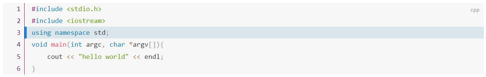

# docsify-codeLineNum

# 作用

为`code`的代码显示添加行号，并高亮显示激活行。


<p style="text-align:center;"></p>

# 安装

在`index.html`中的`<head>`标签中添加：

```html
<script src="https://cdn.jsdelivr.net/gh/spite-triangle/docsify-codeLineNum@latest/css/codeLineNum.css"></script>
```

在`index.html`中的`<body>`标签中添加：

```html
<script src="https://cdn.jsdelivr.net/gh/spite-triangle/docsify-codeLineNum@latest/script/codeLineNum.min.js"></script>
```

# 配置
在`index.html1`中，在`window.$docsify`设置代码块的黑名单，在该黑名单中的代码块，不会显示行号。
```javascript
    window.$docsify = {
      codeLineNum: {
        blacklist: ['python','java']
      }
    }
```


# 使用

在`markdown`中写入代码块

```
    ```cpp
        #include <stdio.h>
        #include <iostream>
        using namespace std;
        void main(int argc, char *argv[]){
            cout << "hello world" << endl;
        }
    ```
```


```term
triangle@LEARN:~$ test
```
